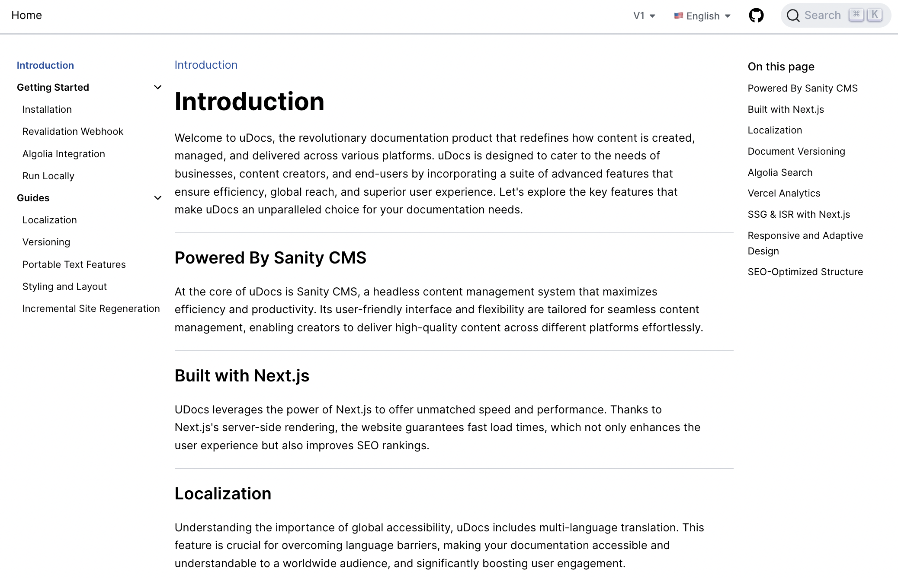

> **_NOTE:_** This project is under construction.

# Next Gen Documentation Website

Simple, powerful and flexible site generation framework
with everything you love from Next.js and Sanity CMS.

<div style="display: flex; flex-wrap: wrap; justify-content: space-around; align-items: center;">
  
  
  
  
  
  
</div>


## Features

- Documentation Localization
- Documentation Versioning
- Algolia Search
- A performant, static docs website with editable projects
- A native and customizable authoring environment, accessible on `docs.com/studio`
- Real-time and collaborative content editing with fine-grained revision history
- Side-by-side instant content preview that works across your whole site
- Support for block content and the most advanced custom fields capability in the industry
- Webhook-triggered Incremental Static Revalidation; no need to wait for a rebuild to publish new content
- Free Sanity project with unlimited admin users, free content updates, and pay-as-you-go for API overages
- A project with starter-friendly and not too heavy-handed TypeScript and Tailwind.css

## Configuration

### Step 1. Set up the environment

Use the Deploy Button below. It will let you deploy the starter using [Vercel](https://vercel.com?utm_source=github&utm_medium=readme&utm_campaign=next-sanity-example) as well as connect it to your Sanity Content Lake using [the Sanity Vercel Integration][integration].

[](https://vercel.com/new/clone?repository-url=https%3A%2F%2Fgithub.com%2FUsmanHaider15%2FuDocs&env=NEXT_PUBLIC_ALGOLIA_INDEX,NEXT_PUBLIC_ALGOLIA_API_KEY,NEXT_PUBLIC_ALGOLIA_APPLICATION_ID,ALGOLIA_ADMIN_API_KEY,NEXT_PUBLIC_SANITY_DATASET,NEXT_PUBLIC_SANITY_PROJECT_ID,SANITY_API_READ_TOKEN,SANITY_API_WRITE_TOKEN,SANITY_REVALIDATE_SECRET,VERCEL_ENV&project-name=udocs&repository-name=uDocs&demo-title=uDocs&demo-description=Nextjs%20Sanity%20CMS%20powered%20%20Documentation%20website&demo-url=https%3A%2F%2Fwww.udocs.io%2Fen&demo-image=https%3A%2F%2Fi.ibb.co%2FZLNf7kh%2FuDocs.png)

### Step 2. Set up the project locally

[Clone the repository](https://docs.github.com/en/repositories/creating-and-managing-repositories/cloning-a-repository) that was created for you on your GitHub account. Once cloned, run the following command from the project's root directory:

```bash
npx vercel link
```

Download the environment variables needed to connect Next.js and the Studio to your Sanity project:

```bash
npx vercel env pull
```

### Step 3. Run Next.js locally in development mode

```bash
npm install && npm run dev
```

When you run this development server, the changes you make in your frontend and studio configuration will be applied live using hot reloading.

Your docs website should be up and running on [http://localhost:3000][localhost-3000]! You can create and edit content on [http://localhost:3000/studio][localhost-3000-studio].

### Step 4. Deploy to production

To deploy your changes to production you use `git`:

```bash
git add .
git commit
git push
```

Alternatively, you can deploy without a `git` hosting provider using the Vercel CLI:

```bash
npx vercel --prod
```

### Import uDocs

import

```
sanity dataset import uDocs.tar.gz production
```
